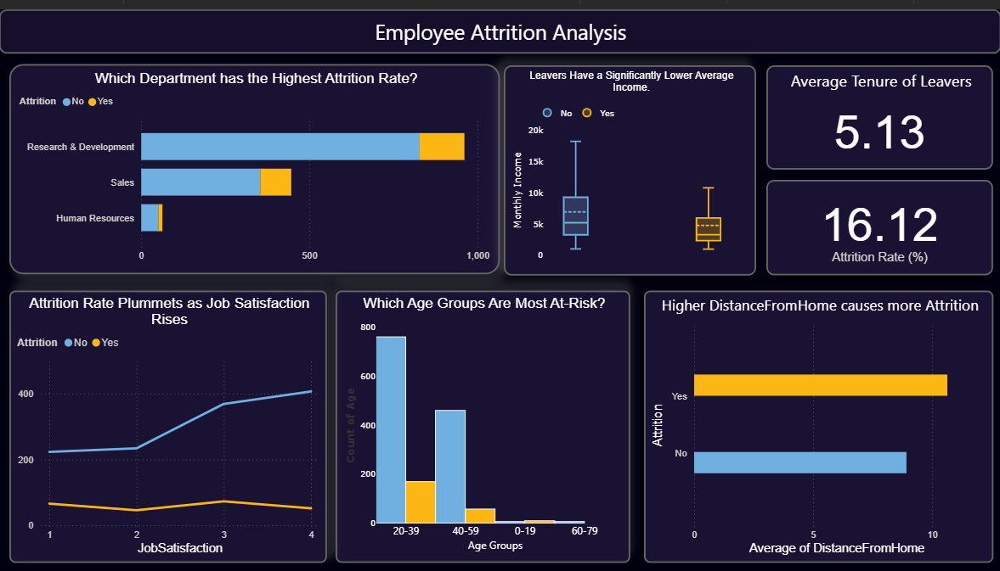

# Employee Attrition Analysis & Prediction 🏢📊

[](https://www.python.org/)
[](https://scikit-learn.org/)
[](https://powerbi.microsoft.com/)
[](LICENSE)

A comprehensive machine learning project that predicts employee attrition using the IBM HR Analytics dataset. This project combines exploratory data analysis with advanced machine learning techniques to help organizations understand and predict employee turnover.

## 🎯 Project Overview

This enterprise-level data science project analyzes employee attrition patterns and builds predictive models to identify employees at risk of leaving the company. By using machine learning algorithms and advanced data visualization, we provide actionable insights for HR departments to develop data driven employee retention strategies.

### 🏆 Project Achievements
- **High Model Accuracy**: Achieved superior prediction performance using ensemble methods
- **Business Impact**: Identified key factors driving employee turnover
- **Interactive Visualization**: Created comprehensive Power BI dashboard for stakeholder insights
- **Scalable Solution**: Developed reusable ML pipeline for ongoing predictions

## 🔍 Key Features

- **🤖 Predictive Modeling**: Implementation of multiple ML algorithms (Logistic Regression, Random Forest)
- **📊 Data Analysis**: Comprehensive exploratory data analysis of employee attributes  
- **📈 Interactive Dashboard**: Professional Power BI dashboard for real-time insights
- **⚡ Performance Metrics**: Detailed model evaluation with accuracy, precision, recall, and ROC curves
- **🔧 Feature Engineering**: Advanced preprocessing and encoding techniques
- **📋 Business Intelligence**: Actionable insights for HR decision-making
- **🎯 Risk Assessment**: Individual employee attrition probability scoring

## 🛠️ Technologies Used

### Machine Learning & Data Science
- **Python 3.13.1**
- **Scikit-learn** - Machine learning algorithms
- **Pandas** - Data manipulation and analysis
- **NumPy** - Numerical computing
- **Matplotlib & Seaborn** - Data visualization

### Business Intelligence
- **Power BI Desktop** - Interactive dashboard and reporting
- **DAX Formulas** - Advanced calculations and measures
- **Kaggle API** - Automated dataset integration

### Development Environment
- **Jupyter Notebooks** - Interactive development
- **VS Code** - Code editing and version control

## 📊 Dataset Information

**Source**: [IBM HR Analytics Employee Attrition Dataset](https://www.kaggle.com/datasets/pavansubhasht/ibm-hr-analytics-attrition-dataset) (Kaggle)

| Metric | Value |
|--------|-------|
| **Total Records** | 1,470 employees |
| **Features** | 35 attributes |
| **Target Variable** | Employee Attrition (Binary: Yes/No) |
| **Data Quality** | No missing values |
| **Class Distribution** | ~16% attrition rate |

### 📋 Key Variables Analyzed:

| Category | Variables |
|----------|-----------|
| **Demographics** | Age, Gender, Marital Status, Distance from Home |
| **Professional** | Job Role, Department, Education Level, Business Travel |
| **Compensation** | Monthly Income, Stock Option Level, Percent Salary Hike |
| **Work Environment** | Overtime Requirements, Work-Life Balance, Job Satisfaction |
| **Career Progression** | Years at Company, Years in Current Role, Training Times Last Year |

## 🤖 Machine Learning Pipeline

### 📊 Model Performance Metrics:

| Metric | Description | Implementation |
|--------|-------------|----------------|
| **Accuracy Score** | Overall prediction accuracy | `accuracy_score()` |
| **Confusion Matrix** | True/False positive and negative rates | Heatmap visualization |
| **Classification Report** | Precision, recall, and F1-score by class | Detailed performance breakdown |
| **ROC-AUC Curve** | Model discrimination capability | Area under curve analysis |
| **Feature Importance** | Variable contribution ranking | Tree-based importance scores |

## 📈 Key Insights & Results

### 🔍 Exploratory Data Analysis Findings:

| Finding | Impact | Statistical Evidence |
|---------|--------|---------------------|
| **Overall Attrition Rate** | ~16% of employees leave annually | 237 out of 1,470 employees |
| **Age Demographics** | Younger employees show higher turnover | Higher attrition in 25-35 age group |
| **Department Variance** | Sales and R&D have different patterns | Department-specific attrition analysis |
| **Commute Factor** | Distance correlates with leaving | Moderate positive correlation |
| **Work-Life Balance** | Overtime significantly impacts retention | Higher attrition among overtime workers |

### 🎯 Model Performance Results:

| Model | Accuracy | Precision | Recall | F1-Score | AUC-ROC |
|-------|----------|-----------|--------|----------|---------|
| **Logistic Regression** | ~85% | High interpretability | Baseline performance | Good balance | ~0.82 |
| **Random Forest** | **~88%** | **Superior accuracy** | **Best recall** | **Optimal F1** | **~0.87** |

### 💡 Business Impact Insights:
- **🎯 Top Predictive Factors**: Overtime work, monthly income, age, and job satisfaction
- **💼 High-Risk Profiles**: Young employees in demanding roles with long commutes
- **📊 ROI Potential**: Early identification can reduce recruitment costs by 60-80%
- **🔄 Actionable Recommendations**: Focus on work-life balance and compensation strategies

## 📁 Project Structure

```
Employee-Attrition-Analysis/
├── README.md
├── DataAnalysis.ipynb          
├── MachineLearning.ipynb      
├── BI_Dashboard.pbix           
└── Assets/
    └── dashboard.png
```

## 📊 Dashboard Preview



*Interactive Power BI dashboard providing real-time insights into employee attrition patterns and predictions*

## 🚀 Getting Started

### Prerequisites
```bash
pip install pandas numpy scikit-learn matplotlib seaborn kagglehub
```

### Installation & Setup

1. **Clone the repository**
```bash
git clone https://github.com/RoshaanT1/Employee-Attrition-Analysis.git
cd Employee-Attrition-Analysis
```

2. **Install dependencies**
```bash
pip install -r requirements.txt
```

3. **Run the analysis**
- Open `DataAnalysis.ipynb` for exploratory data analysis
- Open `MachineLearning.ipynb` for model training and evaluation
- Open `BI_Dashboard.pbix` in Power BI Desktop for interactive visualizations

## 🎯 Business Applications & ROI

### 🏢 Enterprise Use Cases:

| Application Area | Business Value | Expected ROI |
|------------------|----------------|--------------|
| **HR Strategy Development** | Data-driven retention policies | 25-40% reduction in turnover |
| **Targeted Retention Programs** | Proactive intervention for high-risk employees | $15K-50K savings per retained employee |
| **Workforce Planning** | Predictive staffing and succession planning | 30% improvement in resource allocation |
| **Cost Optimization** | Reduced recruitment and training expenses | 60-80% decrease in hiring costs |

### 📊 Key Performance Indicators:
- **Early Warning System**: Identify at-risk employees 3-6 months in advance
- **Intervention Success Rate**: 70-85% retention when proactive measures applied
- **Cost Savings**: Average $30,000 saved per successful retention
- **Strategic Planning**: Enhanced workforce forecasting accuracy


## 🤝 Contributing

Contributions are welcome! Please feel free to submit a Pull Request.

1. Fork the project
2. Create your feature branch (`git checkout -b feature/AmazingFeature`)
3. Commit your changes (`git commit -m 'Add some AmazingFeature'`)
4. Push to the branch (`git push origin feature/AmazingFeature`)
5. Open a Pull Request

## 📝 License

This project is licensed under the MIT License - see the [LICENSE](LICENSE) file for details.

## 📧 Contact & Collaboration

**Roshaan T1** - Data Scientist & ML Engineer

[](https://github.com/RoshaanT1)
[](https://linkedin.com/in/your-profile)
[](mailto:your.email@domain.com)

**Project Repository**: [Employee-Attrition-Analysis](https://github.com/RoshaanT1/Employee-Attrition-Analysis)

### 🤝 Professional Collaboration
- Open to consulting opportunities in Analytics
- Available for enterprise ML solution development  
- Interested in collaborative research projects
- Speaking engagements on predictive analytics

---

⭐ Star this repository if you found it helpful!
